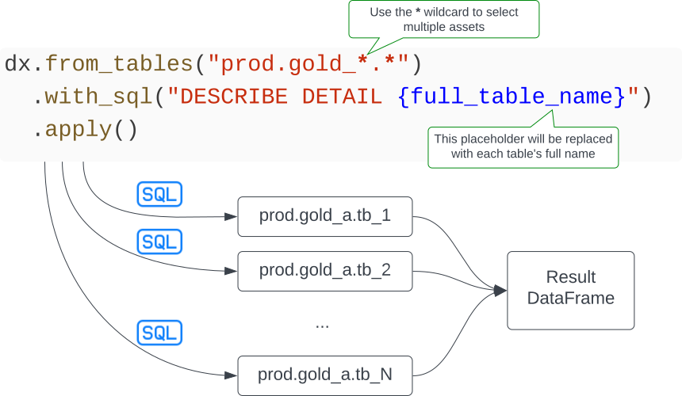
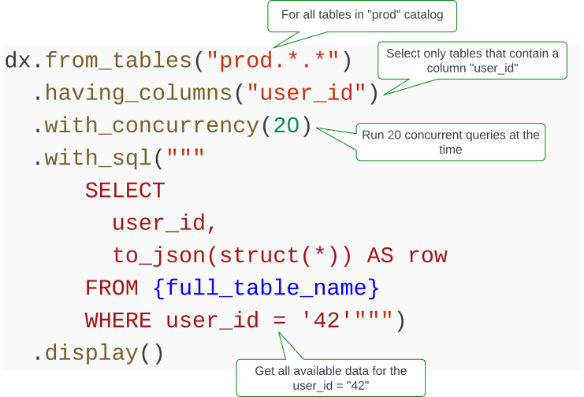
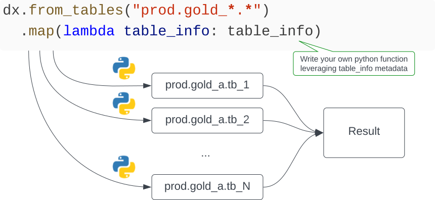

# DiscoverX

[]([https://codecov.io/github/databrickslabs/discoverx](https://github.com/databrickslabs/discoverx))

Your Swiss-Army-knife for Lakehouse administration.

DiscoverX automates administration tasks that require inspecting or applying operations to a large number of Lakehouse assets.

## Multi-table operations with SQL templates

You can execute a SQL template against multiple tables with



DisocoverX will concurrently execute the SQL template against all Delta tables matching the selection pattern and return a Spark DataFrame with the union of all results.

Some useful SQL templates are
* Describe details: `DESCRIBE DETAIL {full_table_name}`
* Show delta history: `SHOW HISTORY {full_table_name}`
* Deep clone: `CREATE TABLE IF NOT EXISTS {table_catalog}.{table_schema}_clone.{table_name} DEEP CLONE {full_table_name}`
* Create an empty copy: `CREATE TABLE IF NOT EXISTS {table_catalog}.{table_schema}.{table_name}_empty_copy LIKE {full_table_name}`
* Tag: `ALTER TABLE {full_table_name} SET TAGS ('tag_name' = 'tag_value')`
* Change owner: `ALTER TABLE {full_table_name} SET OWNER TO principal`
* Show partitions: `SHOW PARTITIONS {full_table_name}`
* Select a sample row as joson from each table: `SELECT to_json(struct(*)) AS row FROM {full_table_name} LIMIT 1`
* Select all pivoted string columns: `SELECT {stack_string_columns} AS (column_name, string_value) FROM {full_table_name}`
* Select all pivoted columns casted to string: `SELECT {stack_all_columns_as_string} AS (column_name, string_value) FROM {full_table_name}`
* Apply liquid clustering: `ALTER TABLE {full_table_name} CLUSTER BY (column1, column2)`
* Vacuum: `VACUUM {full_table_name}`
* Optimize: `OPTIMIZE {full_table_name}`

The available variables to use in the SQL templates are
* `{full_table_name}` - The full table name (catalog.schema.table)
* `{table_catalog}` - The catalog name
* `{table_schema}` - The schema name
* `{table_name}` - Teh table name
* `{stack_string_columns}` - A SQL expression ```stack(N, 'col1', `col1`, ... , 'colN', `colN` )``` for all N columns of type string
* `{stack_all_columns_as_string}` - A SQL expression ```stack(N, 'col1',  cast(`col1` AS string), ... , 'colN',  cast(`colN` AS string)``` for all N columns

### A more advanced SQL example

You can filter tables that only contain a specific column name, and them use the column name in the queries.



## Multi-table operations with python functions

DiscoverX can concurrently apply python funcitons to multiple assets



The properties available in table_info are
* `catalog` - The catalog name
* `schema` - The schema name
* `table` - The table name
* `columns` - A list of `ColumnInfo`, with `name`, `data_type`, and `partition_index`
* `tags` - A list of `TagsInfo`, with `column_tags`, `table_tags`, `schema_tags`, and `catalog_tags`. Tags are only populated if the `from_tables(...)` operation is followed by `.with_tags(True)`

## Example Notebooks

* **Maintenance**
  * [VACUUM all tables](docs/Vacuum.md) ([example notebook](examples/vacuum_multiple_tables.py))
  * Detect tables having too many small files ([example notebook](examples/detect_small_files.py))
  * Deep clone a catalog ([example notebook](examples/deep_clone_schema.py))
* **Governance**
  * PII detection with Presidio ([example notebook](examples/pii_detection_presidio.py))
  * Text Analysis with MosaicML and Databricks MLflow ([example notebook](examples/text_analysis_mosaicml_mlflow.py))
  * Text Analysis with OpenAI GPT ([example notebook](examples/text_analysis_openai_gpt.py))
  * [GDPR right of access: extract user data from all tables at once](docs/GDPR_RoA.md)
  * [GDPR right of erasure: delete user data from all tables at once](docs/GDPR_RoE.md)
  * [Search in any column](docs/Search.md)
  * Update Owner of Data Objects ([example notebook](examples/update_owner_of_data_objects.py))
* **Semantic classification**
  * [Semantic classification of columns by semantic class](docs/Semantic_classification.md): email, phone number, IP address, etc.
  * [Select data based on semantic classes](docs/Select_by_class.md)
  * [Delete data based on semantic classes](docs/Delete_by_class.md)
* **Custom**
  * Create Mlflow gateway routes for MosaicML and OpenAI ([example notebook](examples/mlflow_gateway_routes_examples.py))
  * Scan using User Specified Data Source Formats ([example notebook](examples/scan_with_user_specified_data_source_formats.py))

## Getting started

Install DiscoverX, in Databricks notebook type

```
%pip install dbl-discoverx
```

Get started

```
from discoverx import DX
dx = DX(locale="US")
```

You can now run operations across multiple tables. 

## Available functionality

The available `dx` functions are

* `from_tables("<catalog>.<schema>.<table>")` selects tables based on the specified pattern (use `*` as a wildcard). Returns a `DataExplorer` object with methods
  * `having_columns` restricts the selection to tables that have the specified columns
  * `with_concurrency` defines how many queries are executed concurrently (10 by defailt)
  * `with_sql` applies a SQL template to all tables. After this command you can apply an [action](#from_tables-actions). See in-depth documentation [here](docs/Arbitrary_multi-table_SQL.md).
  * `unpivot_string_columns` returns a melted (unpivoted) dataframe with all string columns from the selected tables. After this command you can apply an [action](#from_tables-actions)
  * `scan` (experimental) scans the lakehouse with regex expressions defined by the rules and to power the semantic classification.
* `intro` gives an introduction to the library
* `scan` [deprecated] scans the lakehouse with regex expressions defined by the rules and to power the semantic classification. [Documentation](docs/Semantic_classification.md)
* `display_rules` shows the rules available for semantic classification
* `search` [deprecated] searches the lakehouse content for by leveraging the semantic classes identified with scan (eg. email, ip address, etc.). [Documentation](docs/Search.md)
* `select_by_class` [deprecated] selects data from the lakehouse content by semantic class. [Documentation](docs/Select_by_class.md)
* `delete_by_class` [deprecated] deletes from the lakehouse by semantic class. [Documentation](docs/Delete_by_class.md)


### from_tables Actions

After a `with_sql` or `unpivot_string_columns` command, you can apply the following actions:

* `explain` explains the queries that would be executed
* `display` executes the queries and shows the first 1000 rows of the result in a unioned dataframe
* `apply` returns a unioned dataframe with the result from the queries

## Requirements

* A [Databricks workspace](https://www.databricks.com/try-databricks#account)
* [Unity Catalog](https://www.databricks.com/product/unity-catalog)

## Project Support
Please note that all projects in the /databrickslabs github account are provided for your exploration only, and are not formally supported by Databricks with Service Level Agreements (SLAs).  They are provided AS-IS and we do not make any guarantees of any kind.  Please do not submit a support ticket relating to any issues arising from the use of these projects.

Any issues discovered through the use of this project should be filed as GitHub Issues on the Repo.  They will be reviewed as time permits, but there are no formal SLAs for support.

