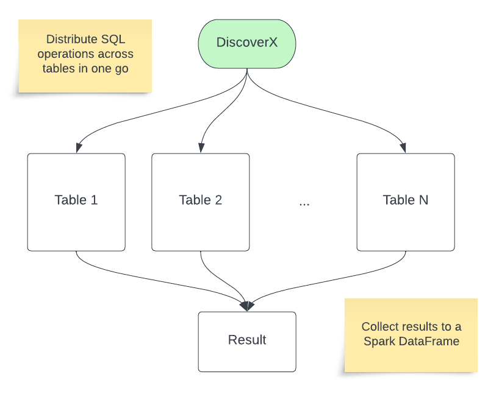

# DiscoverX

Multi-table operations over the lakehouse.



Run a single command to execute operations across many tables. 

## Operations examples

Operations are applied concurrently across multiple tables

* **Maintenance**
  * [VACUUM all tables](docs/Vacuum.md) ([example notebook](examples/vacuum_multiple_tables.py))
  * OPTIMIZE with z-order on tables having specified columns
  * Detect tables having too many small files ([example notebook](examples/detect_small_files.py))
  * Visualise quantity of data written per table per period
  * Delta housekeeping analysis ([example notebook](examples/exec_delta_housekeeping.py)) which provide:
    * stats (size of tables and number of files, timestamps of latest OPTIMIZE & VACUUM operations, stats of OPTIMIZE)
    * recommendations on tables that need to be OPTIMIZED/VACUUM'ed
    * are tables OPTIMIZED/VACUUM'ed often enough
    * tables that have small files / tables for which ZORDER is not being effective
* **Governance**
  * PII detection with Presidio ([example notebook](examples/pii_detection_presidio.py))
  * Text Analysis with MosaicML and Databricks MLflow ([example notebook](examples/text_analysis_mosaicml_mlflow.py))
  * Text Analysis with OpenAI GPT ([example notebook](examples/text_analysis_openai_gpt.py))
  * [GDPR right of access: extract user data from all tables at once](docs/GDPR_RoA.md)
  * [GDPR right of erasure: delete user data from all tables at once](docs/GDPR_RoE.md)
  * [Search in any column](docs/Search.md)
* **Semantic classification**
  * [Semantic classification of columns by semantic class](docs/Semantic_classification.md): email, phone number, IP address, etc.
  * [Select data based on semantic classes](docs/Select_by_class.md)
  * [Delete data based on semantic classes](docs/Delete_by_class.md)
* **Custom**
  * [Arbitrary SQL template execution across multiple tables](docs/Arbitrary_multi-table_SQL.md)
  * Create Mlflow gateway routes for MosaicML and OpenAI ([example notebook](examples/mlflow_gateway_routes_examples.py))

## Getting started

Install DiscoverX, in Databricks notebook type

```
%pip install dbl-discoverx
```

Get started

```
from discoverx import DX
dx = DX(locale="US")
```

You can now run operations across multiple tables. 

As an illustration, consider the scenario where you need to retrieve a single row from various tables within a catalog that begins with "dev_" and includes the term "sample" in their names. To achieve this, the following code block utilizes the dx.from_tables function, which applies an SQL query to extract JSON-formatted data:

```
dx.from_tables("dev_*.*.*sample*")\
  .with_sql("SELECT to_json(struct(*)) AS row FROM {full_table_name} LIMIT 1")\
  .apply()
```

## Available functionality

The available `dx` functions are

* `from_tables("<catalog>.<schema>.<table>")` selects tables based on the specified pattern (use `*` as a wildcard). Returns a `DataExplorer` object with methods
  * `having_columns` restricts the selection to tables that have the specified columns
  * `with_concurrency` defines how many queries are executed concurrently (10 by defailt)
  * `with_sql` applies a SQL template to all tables. After this command you can apply an [action](#from_tables-actions). See in-depth documentation [here](docs/Arbitrary_multi-table_SQL.md).
  * `unpivot_string_columns` returns a melted (unpivoted) dataframe with all string columns from the selected tables. After this command you can apply an [action](#from_tables-actions)
  * `scan` (experimental) scans the lakehouse with regex expressions defined by the rules and to power the semantic classification.
* `intro` gives an introduction to the library
* `scan` scans the lakehouse with regex expressions defined by the rules and to power the semantic classification. [Documentation](docs/Semantic_classification.md)
* `display_rules` shows the rules available for semantic classification
* `search` searches the lakehouse content for by leveraging the semantic classes identified with scan (eg. email, ip address, etc.). [Documentation](docs/Search.md)
* `select_by_class` selects data from the lakehouse content by semantic class. [Documentation](docs/Select_by_class.md)
* `delete_by_class` deletes from the lakehouse by semantic class. [Documentation](docs/Delete_by_class.md)


### from_tables Actions

After a `with_sql` or `unpivot_string_columns` command, you can apply the following actions:

* `explain` explains the queries that would be executed
* `display` executes the queries and shows the first 1000 rows of the result in a unioned dataframe
* `apply` returns a unioned dataframe with the result from the queries

## Requirements

* A [Databricks workspace](https://www.databricks.com/try-databricks#account)
* [Unity Catalog](https://www.databricks.com/product/unity-catalog)

## Project Support
Please note that all projects in the /databrickslabs github account are provided for your exploration only, and are not formally supported by Databricks with Service Level Agreements (SLAs).  They are provided AS-IS and we do not make any guarantees of any kind.  Please do not submit a support ticket relating to any issues arising from the use of these projects.

Any issues discovered through the use of this project should be filed as GitHub Issues on the Repo.  They will be reviewed as time permits, but there are no formal SLAs for support.

