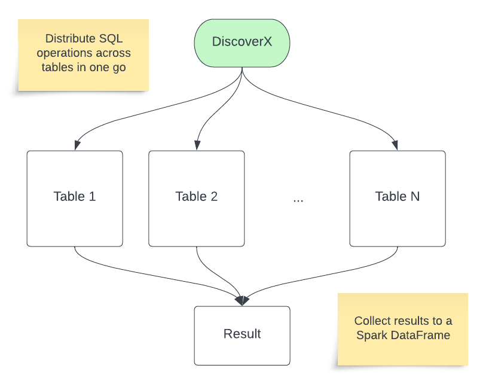

# DiscoverX

Multi-table operations over the lakehouse.



Run a single command to execute operations across many tables. 

## Operations examples

Operations are applied concurrently across multiple tables

* Manitenance operations
  * VACUUM all tables ([example notebook](examples/vacuum_multiple_tables.py))
  * OPTIMIZE with z-order on tables having specified columns
  * Visualise quantity of data written per table per period
* Governance operations
  * [Semantic classification of columns by semantic type](docs/Semantic_classification.md): email, phone number, IP address, etc.
  * PII detection with Presidio ([example notebook](examples/pii_detection_presidio.py))
  * GDPR right of access: extract all data from all tables for a specified user ID
  * GDPR right of erasure: delete all data from all tables for a specified user ID
  * Search in any column
* Custom operations
  * Data transformations based on semantic types
  * [Arbitrary SQL template execution across multiple tables](docs/Arbitrary_multi-table_SQL.md)

## Getting started

Install DiscoverX, in Databricks notebook type

```
%pip install dbl-discoverx
```

Get started

```
from discoverx import DX
dx = DX(locale="US")
```


## Cross-table queries

After a `scan` you can leverage the classified column classes to run cross-table `search`, `delete_by_class` and `select_by_classes` actions.


### Delete

Delete 

Preview delete statements
```
dx.delete_by_class(from_tables="*.*.*", by_class="dx_email", values=['example_email@databricks.com'], yes_i_am_sure=False, min_score=0.95)
```

Execute delete statements
```
dx.delete_by_class(from_tables="*.*.*", by_class="dx_email", values=['example_email@databricks.com'], yes_i_am_sure=True, min_score=0.95)
```

Note: You need to regularly [vacuum](https://docs.delta.io/latest/delta-utility.html#remove-files-no-longer-referenced-by-a-delta-table) all your delta tables to remove all traces of your deleted rows. 

### Select

Select all columns classified with specified classes from multiple tables

```
dx.select_by_classes(from_tables="*.*.*", by_classes=["dx_iso_date", "dx_email"], min_score=None)
```

You can apply further transformations to build your summary tables. 
Eg. Count the occurrence of each IP address per day across multiple tables and columns

```
df = (dx.select_by_classes(from_tables="*.*.*", by_classes=["dx_iso_date", "dx_ip_v4"])
    .groupby(["table_catalog", "table_schema", "table_name", "classified_columns.dx_iso_date.column", "classified_columns.dx_iso_date.value", "classified_columns.dx_ip_v4.column"])
    .agg(func.count("classified_columns.dx_ip_v4.value").alias("count"))
)
```

## Requirements

* A [Databricks workspace](https://www.databricks.com/try-databricks#account)
* [Unity Catalog](https://www.databricks.com/product/unity-catalog)

## Project Support
Please note that all projects in the /databrickslabs github account are provided for your exploration only, and are not formally supported by Databricks with Service Level Agreements (SLAs).  They are provided AS-IS and we do not make any guarantees of any kind.  Please do not submit a support ticket relating to any issues arising from the use of these projects.

Any issues discovered through the use of this project should be filed as GitHub Issues on the Repo.  They will be reviewed as time permits, but there are no formal SLAs for support.

